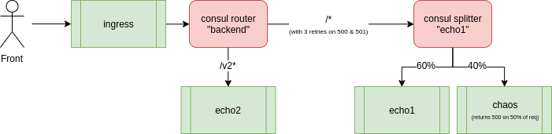

# Nomad & Consul Connect demo stack




## Requirements

- virtualbox
- vagrant

This project uses Ansible but __you don't need it on your host__ : it's installed on a VM by Vagrant and provisions everything from there.


## tech stack 
- [ Packer ](https://www.packer.io/) : bake a custom image with everything _instance agnostic_ installed and setup
- [Cloud-init](https://cloudinit.readthedocs.io/en/latest/index.html) : set everything _instance specific_
- [Vagrant](https://www.vagrantup.com/) : start the VMs

- [ Consul & Consul Connect ](https://www.consul.io/) : service discovery, internal DNS & service mesh
- [ Nomad ](https://www.nomadproject.io/) : orchestration
- [ Jaeger ](https://www.jaegertracing.io/) : distributed tracing
- Prometheus (monitoring)
- Fluent-bit & Loki (logs)
- Grafana (visualization)
- Terraform (manage Nomad & Consul in a fully declarative way)

## Run

We'll use the same custom baked image for every VM. 

It's based on the "hashicorp/bionic64" (it's an ubuntu) image and installs on it 
- consul
- cni-plugins (used by consul connect)
- nomad
- terraform

```
vagrant plugin install vagrant-cloudinit
vagrant up
```

That's it ! Have a cup of coffee while looking at Vagrant upping the VMs and setting everything for you.

## Setup Nomad & Consul services 

```
vagrant ssh ci

cd ~/consul/
terraform init
terraform apply

cd ~/nomad/
terraform init
terraform apply
```

### Check

NB : the ssh password is `vagrant`

__Consul__ : 

```
ssh -L localhost:8500:localhost:8500 -i ./.vagrant/machines/monitoring/virtualbox/private_key vagrant@172.16.2.10
```

open [http://localhost:8500](http://localhost:8500)


__Nomad__ : 

```
ssh -L localhost:4646:localhost:4646 -i ./.vagrant/machines/monitoring/virtualbox/private_key vagrant@172.16.2.10
```

open [http://localhost:4646](http://localhost:4646)


__Jaeger__ :

```
ssh -L localhost:16686:localhost:16686 -i ./.vagrant/machines/monitoring/virtualbox/private_key vagrant@172.16.2.10
``` 

then  [http://localhost:16686](http://localhost:16686)


__Prometheus__ :

```
ssh -L localhost:9090:localhost:9090 -i ./.vagrant/machines/monitoring/virtualbox/private_key vagrant@172.16.2.10
``` 

then  [http://localhost:9090](http://localhost:9090)

__Grafana__ :

```
ssh -L localhost:3000:localhost:3000 -i ./.vagrant/machines/monitoring/virtualbox/private_key vagrant@172.16.2.10
``` 

then  [http://localhost:3000](http://localhost:3000)

__App__ :

```
curl 172.16.1.10:9090
"==> echo 1"

curl 172.16.1.10:9090/v2
"==> echo 2"
```

## Nota Bene

Due to a [current issue](https://github.com/hashicorp/nomad/issues/6459) in Nomad, upgrading the Connect stanza of a job needs to do 

```
nomad job stop <nameOfTheJob>
nomad run ./job.hcl
```
